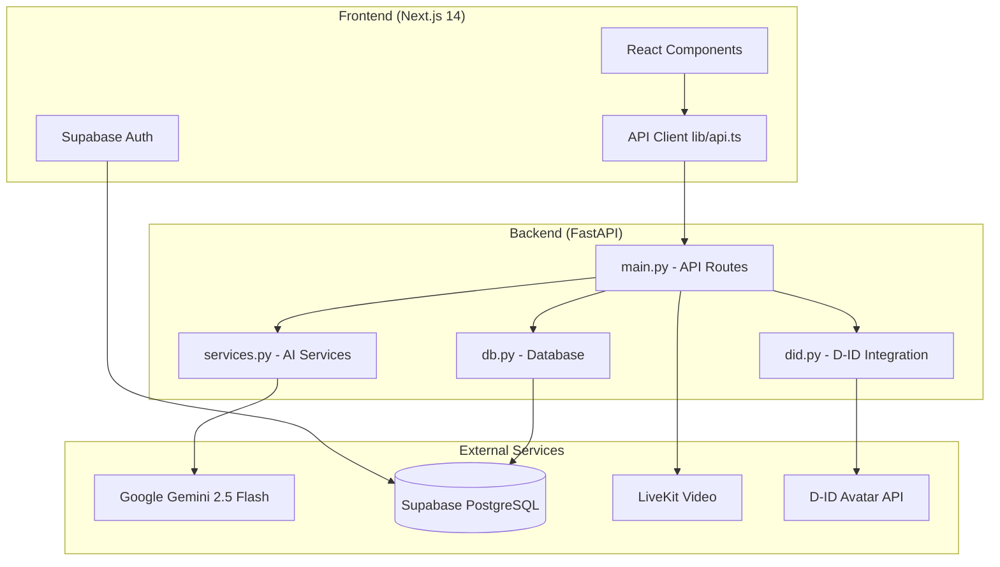
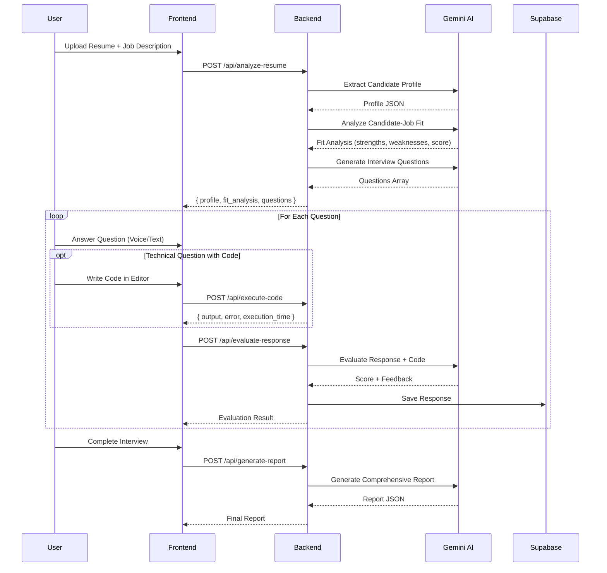

# TestSysAI Documentation

> **Agentic Interviewer Platform** - An AI-powered interview simulation and candidate assessment system

---

## Table of Contents

1. [High-Level Architecture](#high-level-architecture)
2. [System Components](#system-components)
3. [Data Flow](#data-flow)
4. [API Endpoints](#api-endpoints)
5. [AI Prompts Reference](#ai-prompts-reference)
6. [Database Schema](#database-schema)
7. [Frontend Structure](#frontend-structure)
8. [AI Evaluation Suite](#ai-evaluation-suite)

---

## High-Level Architecture



---

## System Components

### Backend Stack

| Component | Technology | Purpose |
|-----------|------------|---------|
| **API Framework** | FastAPI | REST API endpoints with async support |
| **AI Model** | Gemini 2.5 Flash | All AI-powered analysis and generation |
| **PDF Processing** | PyPDF2 | Resume text extraction |
| **Video Conferencing** | LiveKit | Real-time interview simulation |
| **Avatar Generation** | D-ID API | AI talking avatar videos |
| **Database** | Supabase (PostgreSQL) | User data, sessions, responses |

### Frontend Stack

| Component | Technology | Purpose |
|-----------|------------|---------|
| **Framework** | Next.js 14 (App Router) | React-based SSR/SSG |
| **Styling** | Tailwind CSS | Utility-first CSS |
| **Animation** | Framer Motion | Page transitions, micro-interactions |
| **Charts** | Recharts | Dashboard visualizations |
| **Auth** | Supabase Auth | User authentication |
| **Icons** | Lucide React | Icon library |

---

## Data Flow

### Interview Workflow



---

## API Endpoints

### Core Interview APIs

| Endpoint | Method | Description |
|----------|--------|-------------|
| `/api/analyze-resume` | POST | Upload resume PDF, analyze fit, generate questions |
| `/api/evaluate-response` | POST | Evaluate a single interview response |
| `/api/generate-report` | POST | Generate final interview report |

### Session & Dashboard APIs

| Endpoint | Method | Description |
|----------|--------|-------------|
| `/api/save-session-analysis` | POST | Save CV fit analysis for a session |
| `/api/session-analysis/{id}` | GET | Retrieve session analysis |
| `/api/dashboard-stats` | GET | Aggregated statistics for dashboard |

### AI Assistant APIs

| Endpoint | Method | Description |
|----------|--------|-------------|
| `/api/query-report` | POST | Ask AI questions about a report |
| `/api/ai-recommendations` | POST | Get 2-step gap analysis recommendations |

### Integration APIs

| Endpoint | Method | Description |
|----------|--------|-------------|
| `/api/get-token` | POST | Generate LiveKit access token |
| `/api/did/create-talk` | POST | Create D-ID talking avatar video |
| `/api/did/talk/{id}` | GET | Get D-ID video status/result |

### Code Execution APIs

| Endpoint | Method | Description |
|----------|--------|-------------|
| `/api/execute-code` | POST | Execute Python or JavaScript code in sandboxed environment |

---

## AI Prompts Reference

### 1. Candidate Profile Extraction

**Function:** `run_candidate_profile_extraction()`  
**Location:** `services.py:301-347`  
**Purpose:** Extract structured candidate information from resume

```text
You are an expert HR Resume Parser.

RESUME:
{resume_text}

TASK:
Extract the following information from the resume:

1. **Current Role**: The candidate's most recent or current job title.
2. **Location**: The candidate's location (city, state/country).
3. **Educational Level**: The highest education level (e.g., "Bachelor's Degree", "Master's Degree", "PhD").
4. **Experience**: Calculate the TOTAL years of professional experience by:
   - Finding all job positions with date ranges
   - For "Present" or "Current", use 2026 as the end year
   - SUM all durations to get total years

OUTPUT (JSON only):
{
    "current_role": "Job Title",
    "location": "City, Country",
    "educational_level": "Degree (Field if available)",
    "experience_years": 5,
    "experience_breakdown": "Brief breakdown of how years were calculated"
}
```

---

### 2. Candidate-Job Fit Analysis

**Function:** `analyze_candidate_fit()`  
**Location:** `services.py:475-524`  
**Purpose:** Assess resume-job description alignment

```text
You are an expert HR Analyst specializing in candidate-job fit assessment.

JOB DESCRIPTION:
{job_description}

CANDIDATE'S RESUME:
{resume_text}

TASK:
Analyze how well this candidate matches the job requirements.

IMPORTANT FORMATTING RULES:
- Do NOT use markdown formatting (no **, no *, no #)
- Each strength/weakness should be in format: "Short Title: Detailed explanation"
- Keep titles under 5 words
- Explanations should be 1-2 sentences

OUTPUT (JSON only):
{
    "strengths": [
        "AI Experience: Candidate has 3+ years developing ML models with TensorFlow and PyTorch.",
        "Leadership Skills: Led a team of 5 engineers and delivered project 2 weeks early.",
        "Technical Depth: Strong backend experience with Python, FastAPI, and PostgreSQL."
    ],
    "weaknesses": [
        "No WebRTC Experience: Resume does not mention real-time streaming technologies.",
        "Limited Cloud Skills: No evidence of Kubernetes or AWS experience.",
        "Missing Security Focus: No mention of GDPR or data privacy implementation."
    ],
    "fit_score": 75,
    "summary": "Brief overall assessment of candidate fit for this role."
}
```

---

### 3. Interview Question Generation

**Function:** `generate_questions_from_jd()`  
**Location:** `services.py:527-579`  
**Purpose:** Generate role-specific interview questions

```text
You are an Expert Interviewer creating questions to assess candidates for this role.

JOB DESCRIPTION:
{job_description}

INTERVIEW TYPE: {interview_type}

INSTRUCTIONS:
1. Generate exactly {question_count} interview questions based on the criteria below.
2. **INTERVIEW TYPE FOCUS**:
   - **Technical**: Focus STRICTLY on Data Structures and Algorithms (Simple to Medium).
     Do NOT ask about specific frameworks unless explicitly required.
   - **Abstract Knowledge** (Behavioral): Focus STRICTLY on behavioral questions (STAR method),
     culture fit, soft skills, and situational judgment. NO technical coding questions.
   - **Mixed**: A balanced mix of technical and behavioral.
3. Include a mix of "Easy", "Medium", and "Hard".
4. SCORING RULES:
   - Hard questions: 10-15 points
   - Medium questions: 7-10 points
   - Easy questions: 3-7 points
   - **CRITICAL: The total of all max_points MUST equal exactly 100.**

OUTPUT FORMAT (JSON only):
{
    "questions": [
        {
            "id": 1,
            "title": "Topic from JD",
            "question_text": "The actual interview question to ask",
            "difficulty": "Easy",
            "max_points": 5,
            "scoring_criteria": "What to look for in a good answer"
        }
    ]
}
```

---

### 4. Response Evaluation

**Function:** `evaluate_single_response()`  
**Location:** `services.py:87-147`  
**Purpose:** Score and provide feedback on interview answers

```text
You are an expert technical interviewer evaluating a candidate's response.

QUESTION:
Title: {question.title}
Question: {question.question_text}
Difficulty: {question.difficulty}
Max Points: {question.max_points}
Scoring Criteria: {question.scoring_criteria}

{code_context if provided}

CANDIDATE'S VERBAL RESPONSE:
"{response}"

TASK:
Evaluate the response (and code if provided) and provide:
1. A score out of the max points
2. Brief feedback on what was good
3. Brief feedback on what could be improved

OUTPUT (JSON only):
{
    "score": 7,
    "max_points": 10,
    "feedback_positive": "Brief positive feedback",
    "feedback_improvement": "Brief improvement suggestion"
}
```

---

### 5. Interview Report Generation

**Function:** `generate_interview_report()`  
**Location:** `services.py:150-296`  
**Purpose:** Create comprehensive final report combining resume + interview data

```text
You are a Senior HR Manager writing a comprehensive interview evaluation report.

Your task is to synthesize insights from TWO sources:
1. **Resume Analysis**: What we learned about the candidate BEFORE the interview
2. **Interview Performance**: How the candidate actually performed during the interview

CANDIDATE PROFILE (from Resume):
- Current Role: {current_role}
- Experience: {experience_years} years
- Education: {educational_level}

RESUME ANALYSIS (Pre-Interview):
Fit Score: {fit_score}%
Resume Strengths: {strengths}
Resume Gaps: {weaknesses}

INTERVIEW PERFORMANCE:
Total Score: {total_score}/{max_total} ({percentage}%)

QUESTION-BY-QUESTION BREAKDOWN:
{qa_summary JSON}

CRITICAL INSTRUCTIONS:
1. Generate EXACTLY 3 "Points Forts" (Strengths) - combine evidence from both resume AND interview
2. Generate EXACTLY 3 "Axes d'amélioration" (Areas for Improvement) - based on interview gaps AND resume weaknesses
3. Each point should be 1-2 sentences, specific and actionable
4. If interview data is limited, lean more on resume analysis
5. Write in a professional, encouraging tone

FORMAT RULES:
- Each strength should follow: "Skill/Quality: Brief explanation with evidence"
- Each weakness should follow: "Area: Specific improvement suggestion"
- DO NOT use markdown formatting (no **, no *, no #)

OUTPUT (JSON only):
{
    "overall_score": 45,
    "max_score": 60,
    "percentage": 75,
    "overall_assessment": "2-3 sentence summary combining resume fit and interview performance",
    "strengths": [
        "First Strength: Evidence from resume and/or interview performance",
        "Second Strength: Evidence from resume and/or interview performance",
        "Third Strength: Evidence from resume and/or interview performance"
    ],
    "weaknesses": [
        "First Area: Specific improvement suggestion based on gaps identified",
        "Second Area: Specific improvement suggestion based on gaps identified",
        "Third Area: Specific improvement suggestion based on gaps identified"
    ],
    "recommendations": [
        "Actionable recommendation 1",
        "Actionable recommendation 2",
        "Actionable recommendation 3"
    ],
    "hiring_recommendation": "Hire/Strong Hire/Maybe/No Hire",
    "hiring_rationale": "Brief explanation combining resume fit and interview evidence"
}
```

---

### 6. Report Query (Ask AI Assistant)

**Function:** `query_report()`  
**Location:** `services.py:612-681`  
**Purpose:** Answer user questions about their interview report

```text
You are an Expert Report Analyst. Your goal is to answer questions based strictly on the provided report.

REPORT CONTENT:
{report_text including scores, strengths, weaknesses, recommendations}

USER QUESTION:
{user_question}

INSTRUCTIONS:
1. Extract relevant data points and quotes from the report.
2. Synthesize an answer that directly addresses the user question.
3. The answer should be relevant, interesting and reveal a true insight about the report.

OUTPUT FORMAT (JSON only):
{
    "answer": "The detailed response"
}
```

---

### 7. AI Coach Recommendations (2-Step Analysis)

**Function:** `generate_ai_recommendations()`  
**Location:** `services.py:686-818`  
**Purpose:** Deep-dive gap analysis with actionable recommendations

#### Step 1: Gap Analysis

```text
Analyze the candidate's response against the source report.

CANDIDATE TRANSCRIPT:
{candidate_transcript}

SOURCE REPORT:
{source_report_text}

INSTRUCTIONS:
1. List all technical terms mentioned in the report that the candidate OMITTED.
2. Identify specific "generic" phrases used by the candidate (e.g., "very efficient," "highly scalable") that lack data-backed evidence.
3. Provide the results in a structured format.

OUTPUT FORMAT (JSON only):
{
    "omitted_technical_concepts": ["concept1", "concept2", "concept3"],
    "generic_phrases_detected": ["phrase1", "phrase2"],
    "missing_data_points": ["datapoint1", "datapoint2"]
}
```

#### Step 2: Recommendations Generation

```text
Using the extracted gaps, generate specific, deep-dive recommendations for the AI Coach sidebar.

GAPS ANALYSIS:
- Omitted Technical Concepts: {concepts}
- Generic Phrases Detected: {phrases}
- Missing Data Points: {data_points}

ORIGINAL REPORT CONTEXT:
{source_report_text}

INSTRUCTIONS:
1. For every "generic phrase" identified, provide a technical replacement using concepts from the report.
2. Formulate "Technical Depth" advice that requires the candidate to explain the LOGIC, not just state the result.
3. Ensure the advice is pragmatically useful and actionable.
4. Generate exactly 3 recommendations in categories: Technical Depth, Communication Style, Speaking Pace.

OUTPUT FORMAT (JSON only):
{
    "recommendations": [
        {
            "category": "Technical Depth",
            "content": "Specific actionable advice about technical concepts to mention and how to explain them with logic"
        },
        {
            "category": "Communication Style", 
            "content": "Specific advice about replacing generic phrases with data-backed statements"
        }
    ],
    "confidence_score": 85,
    "gaps_summary": "Brief summary of most critical gaps identified"
}
```

---

### 8. Code Execution

**Function:** `execute_code()`  
**Location:** `main.py:671-776`  
**Purpose:** Safely execute Python or JavaScript code during technical interviews

**Request:**

```json
{
    "code": "print('Hello, World!')",
    "language": "python"  // or "javascript"
}
```

**Response:**

```json
{
    "success": true,
    "output": "Hello, World!\n",
    "error": "",
    "execution_time": 0.045,
    "exit_code": 0
}
```

**Security Features:**
- 5-second timeout limit
- 10KB output limit
- Blocked dangerous imports (os, subprocess, sys, socket, shutil)
- Blocked dangerous functions (eval, exec, open, compile, __import__)
- Sandboxed execution in /tmp directory
- Temporary files cleaned up after execution

---

## Database Schema

### Tables (Supabase)

| Table | Purpose |
|-------|---------|
| `interview_responses` | Stores individual question responses and evaluations |
| `session_analyses` | Stores fit analysis and session metadata |
| `users` | User authentication (managed by Supabase Auth) |

### Key Fields: `interview_responses`

```sql
id            UUID PRIMARY KEY
session_id    TEXT NOT NULL
user_id       UUID REFERENCES auth.users
question_text TEXT
response      TEXT
score         INTEGER
max_points    INTEGER
feedback_positive     TEXT
feedback_improvement  TEXT
created_at    TIMESTAMPTZ DEFAULT NOW()
```

### Key Fields: `session_analyses`

```sql
id              UUID PRIMARY KEY
session_id      TEXT UNIQUE NOT NULL
session_name    TEXT
user_id         UUID REFERENCES auth.users
fit_analysis    JSONB
interview_type  TEXT
created_at      TIMESTAMPTZ DEFAULT NOW()
```

---

## AI Evaluation Suite

The **AI Eval** directory typically located at the project root contains a specialized suite for evaluating the quality, accuracy, and fairness of the AI interviewer's feedback.

### Key Components

#### 1. Agent Response Assessment
**File:** `agent_response_assessment.py`
- **Purpose:** Evaluate the factual correctness and accuracy of AI agent outputs.
- **Method:** Uses basic exact-match accuracy metrics (customizable for strictness).
- **Usage:** Validates that the agent returns expected answers for deterministic queries.

#### 2. LLM-as-a-Judge Framework
**File:** `llm_as_judge.py`
- **Purpose:** Evaluate subjective qualities of the AI's feedback (Helpfulness, Specificity, Accuracy, Constructiveness, Fairness).
- **Method:** Uses a powerful LLM (Gemini 2.5) as a meta-evaluator to judge the primary AI's performance.
- **Integration:** Connects directly to Supabase to fetch real interview evaluations.

#### 3. Interactive Evaluation Dashboard
**File:** `dashboard.py`
- **Purpose:** A visual interface for analyzing AI performance and managing the prompt optimization loop.
- **Features:** 
  - **Metrics**: Real-time view of Average Quality, Helpfulness, and Calibration Bias.
  - **Visuals**: Charts comparing AI scores vs. Judge scores and qualitative radar plots.
  - **Inspection**: Detailed view of full evaluation rationale and JSON data.
  - **Optimizer**: UI for running the Advanced Prompt Optimization Loop.

#### 4. Contract Revision System (Advanced Prompt Optimizer)
**File:** `advanced_prompt_optimizer.py`
- **Purpose:** A closed-loop system to automatically improve the AI's prompts based on evaluation evidence.
- **5-Stage Architecture:**
  1. **Collect Evidence**: Aggregates human/LLM judge scores and failure patterns.
  2. **Analyze Patterns**: Identifies root causes (e.g., "AI is too lenient" or "Feedback is vague").
  3. **Generate Candidates**: Brainstorms multiple prompt variations ("Fixer", "Socratic", "Auditor").
  4. **A/B Test**: Simulates performance on a "Golden Set" of known test cases to find the winner.
  5. **Deploy**: Selects the best performing prompt and prepares it for production deployment.

### Evaluation Workflow

1. **Fetch Evaluations**: The system retrieves recent interview sessions and their corresponding AI evaluations from Supabase.
2. **Meta-Evaluation**: The "Judge" LLM analyzes the interview question, candidate response, and the AI's feedback.
3. **Scoring**: The Judge scores the AI's feedback on a 1-5 scale across multiple dimensions:
   - **Helpfulness**: Is the feedback actionable?
   - **Specificity**: Does it reference specific parts of the answer?
   - **Accuracy**: Is the assessment factually correct?
   - **Constructiveness**: Is the tone encouraging?
   - **Fairness**: Is the score well-calibrated?
4. **Reporting**: Results are displayed in a detailed CLI table and saved to `eval_results.json`.

**Running the Evaluation & Dashboard:**
```bash
cd "AI Eval"

# 1. Run the backend evaluation engine
python3.11 llm_as_judge.py

# 2. Launch the visual dashboard
streamlit run dashboard.py
```

---

## Frontend Structure

```
frontend/src/
├── app/                          # Next.js App Router
│   ├── page.tsx                  # Landing page
│   ├── layout.tsx                # Root layout
│   └── dashboard/
│       ├── page.tsx              # Main dashboard
│       ├── campaigns/page.tsx    # Interview history
│       ├── new-simulation/page.tsx # Start new interview
│       ├── simulation/page.tsx   # Live interview UI
│       ├── report/[id]/page.tsx  # Report view
│       └── profile/page.tsx      # User profile
│
├── components/
│   ├── Navbar.tsx                # Main navigation
│   ├── Footer.tsx                # Site footer
│   ├── Features.tsx              # Landing page features
│   └── dashboard/
│       ├── DashboardNavbar.tsx   # Dashboard navigation
│       ├── InterviewCard.tsx     # Interview session card
│       ├── CodeEditorPanel.tsx   # Monaco-based code editor with execution
│       ├── PerformanceChart.tsx  # Recharts performance visualization
│       └── RecommendationSidebar.tsx # AI Coach sidebar
│
├── lib/
│   ├── api.ts                    # Backend API client
│   ├── supabase.ts               # Supabase client config
│   └── utils.ts                  # Utility functions
│
└── middleware.ts                 # Auth middleware
```

---

## Environment Variables

### Backend (.env)

```env
GEMINI_API_KEY=your_gemini_api_key
SUPABASE_URL=https://your-project.supabase.co
SUPABASE_SERVICE_KEY=your_service_key
LIVEKIT_API_KEY=your_livekit_key
LIVEKIT_API_SECRET=your_livekit_secret
LIVEKIT_URL=wss://your-livekit-instance.livekit.cloud
DID_API_KEY=your_did_api_key
```

### Frontend (.env)

```env
NEXT_PUBLIC_API_URL=http://localhost:8000
NEXT_PUBLIC_SUPABASE_URL=https://your-project.supabase.co
NEXT_PUBLIC_SUPABASE_ANON_KEY=your_anon_key
```

---

## Running the Application

### Backend

```bash
cd backend
python3.11 -m uvicorn backend.main:app --reload --port 8000
```

### Frontend

```bash
cd frontend
npm run dev
```

---

*Documentation generated for TestSysAI - Agentic Interviewer Platform*
